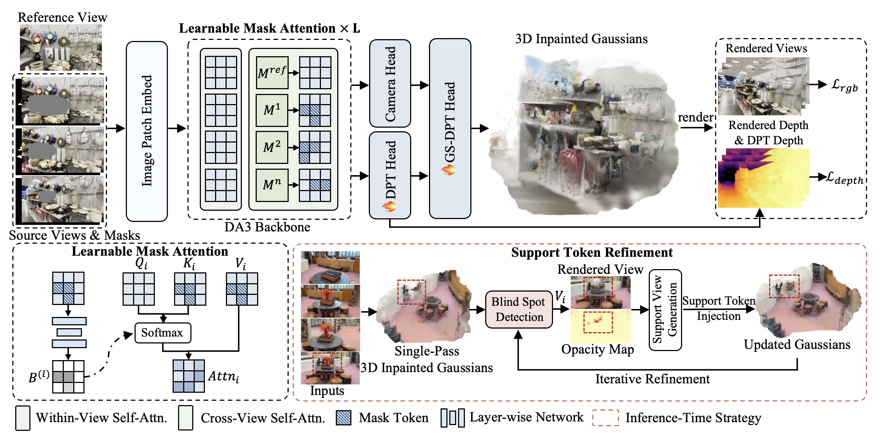

# FreeInpaint

## Pose-Free Feed-Forward 3D Inpainting via Learnable Mask Attention and Support Token Refinement

> [Jingyi Pan](https://rorisis.github.io/)<sup>1</sup>, [Dan Xu](https://www.danxurgb.net/)<sup>2</sup>, [Qiong Luo](https://www.cse.ust.hk/~luo/)<sup>1,2</sup> <br>
> <sup>1</sup>The Hong Kong University of Science and Technology (Guangzhou)<br>
> <sup>2</sup>The Hong Kong University of Science and Technology<br>
>
> NeurIPS 2026
> 

<div align=center>

</div>

## Abstract
3D scene inpainting aims to recover missing or occluded regions in edited 3D scenes, while ensuring geometric and textural consistency. Existing approaches, however, typically require accurately calibrated camera poses, which restricts their applicability in casual, in-the-wild scenarios and introduces additional preprocessing overhead. To overcome this limitation, we present **FreeInpaint**, a novel feed-forward framework that generates complete and 3D-consistent scenes directly from unposed multi-view images with masked regions. At its core, FreeInpaint extends a 3D foundation model to propagate masked regions from a reference view to other unposed views, bridging 3D reconstruction and scene inpainting while preserving the model's native ability to recover camera poses and scene geometry. Our method addresses two key challenges in adapting feed-forward 3D foundation models to masked inputs. First, masked regions can corrupt cross-view correspondence reasoning, degrading pose estimation and geometry recovery. To address this, we introduce a Learnable Mask Attention mechanism that preserves the spatial anchoring of reliable observations while allowing masked regions to progressively absorb useful context in deeper layers. Second, under severe occlusions, a single forward pass often lacks sufficient appearance evidence for high-fidelity completion. Therefore, we propose a Support Token Refinement strategy, which injects diffusion-generated support evidence as confidence-weighted auxiliary tokens to refine under-observed regions while preserving the original spatial anchor. Extensive experiments across diverse datasets demonstrate that FreeInpaint achieves superior inpainting quality, eliminating the reliance on pre-computed camera poses while keeping a fast inference speed.

## Installation

Use Linux, Python 3.12, and an NVIDIA GPU. A CUDA toolkit with `nvcc`, a compatible C++ compiler, and Git are needed for the Gaussian rasterizer and source dependencies. The core versions in `requirements.txt` follow our inference environment.

```bash
conda create -n freeinpaint python=3.12 -y
conda activate freeinpaint
pip install torch==2.9.1 torchvision==0.24.1 --index-url https://download.pytorch.org/whl/cu128
pip install -r requirements.txt
```

## Model weights

Place the released [FreeInpaint weights](https://huggingface.co/jyproris/FreeInpaint/tree/main/checkpoints) at:

```text
checkpoints/freeinpaint.pth
```

For automatic reference inpainting, obtain the **PowerPaint ppt-v1** weights from [PowerPaint](https://github.com/open-mmlab/PowerPaint) or [Hugging Face](https://huggingface.co/jyproris/FreeInpaint/tree/main/checkpoints) and arrange them as:

```text
checkpoints/ppt-v1/
  unet/unet.safetensors
  text_encoder/text_encoder.safetensors
```

## Demo Data
Download the [demo data](https://huggingface.co/jyproris/FreeInpaint/tree/main) and extract it into the `data/` directory. The directory structure should be:

```text
FreeInpaint/
├── data/
│   ├── spinnerf_dataset_processed/
│   │   └── <scene_name>/
│   ├── 360-USID/
│   │   └── <scene_name>/
│   ├── gs25/
│   │   └── <scene_name>/
│   │       ├── input/
│   │       └── masks/           # Optional; generated from --mask_prompt if absent
│   └── co3d/
│       └── <category>/
│           └── <sequence_name>/
│               ├── images/
│               └── masks/
```

Keep the original directory structure within each scene. If the datasets are stored elsewhere, update the corresponding dataset roots in `config/test.yaml` or specify `--data_root` when running inference.

For SPIn-NeRF, input views are specified in `config/spinnerf.json`, and the inpainted reference is generated automatically and cached for reuse. For 360-USID, the dataset-provided inpainted reference is loaded from each scene's `reference/` directory.

The complete datasets can be downloaded from their respective project pages: [SPIn-NeRF](https://github.com/SamsungLabs/SPIn-NeRF), [360-USID](https://github.com/kkennethwu/AuraFusion360_official), [GS25](https://3dego.github.io/), [CO3D](https://github.com/facebookresearch/co3d).

## Inference

SPIn-NeRF defaults to one forward pass without Support Token Refinement, while the other datasets default to three forward passes. Use `--num_refinement_iters` to override this setting; setting it to `1` disables refinement.

### SPIn-NeRF and 360-USID

```bash
# A single SPIn-NeRF scene (4 inputs)
CUDA_VISIBLE_DEVICES=0 python test.py --dataset spinnerf --scene_name book \
  --data_root /path/to/spinnerf_dataset_processed --negative_prompt book

# A single USID scene (8 inputs, dataset-provided reference)
CUDA_VISIBLE_DEVICES=0 python test.py --dataset usid --scene_name plant \
  --data_root /path/to/360-USID --negative_prompt plant

# All benchmark scenes (stop on error; edit the scene lists in scripts/)
CUDA_VISIBLE_DEVICES=0 bash scripts/test_spinnerf.sh --data_root /path/to/spinnerf_dataset_processed
CUDA_VISIBLE_DEVICES=0 bash scripts/test_usid.sh --data_root /path/to/360-USID
```

### In-the-wild scenes: GS25 and CO3D

```bash
# GS25 (8 views); remove the cup rather than every foreground object
CUDA_VISIBLE_DEVICES=0 python test.py --dataset gs25 \
  --data_root /path/to/gs25 --scene_name bagpack_laptop_cup \
  --mask_prompt cup --negative_prompt cup --save_gs

# CO3D native masks; no camera annotation files are needed
CUDA_VISIBLE_DEVICES=0 python test.py --dataset co3d \
  --data_root /path/to/co3d \
  --category cup --sequence_name 14_202_1205 \
  --num_input_views 8 --negative_prompt cup --save_gs

# Batch examples (edit the scene lists in the respective scripts)
CUDA_VISIBLE_DEVICES=0 bash scripts/test_gs25.sh --data_root /path/to/gs25
CUDA_VISIBLE_DEVICES=0 bash scripts/test_co3d.sh --data_root /path/to/co3d
```

Omit `--save_gs` if Gaussian export is not needed.

### Outputs and useful options

Outputs go to `results/<dataset>/<scene>/<task>/` (CO3D includes category/sequence):

- `{id}.png`, `{id}_gt.png`, `{id}_gt_mask.png`, and `{id}_depth.npy`.
- `reference.png`, generated `support_*.png`, `refinement.json`, and `predicted_cameras.npz`.
- `result.json` records the dataset/scene, completion status, clean-GT availability, and any failure message; 
- `--save_gs` exports `gaussians.ply`; `--render_video` exports `video.mp4`.

## Evaluation

```bash
CUDA_VISIBLE_DEVICES=0 python metrics/evaluate.py --dataset spinnerf --results_root results/spinnerf
CUDA_VISIBLE_DEVICES=0 bash scripts/evaluate.sh usid results/usid
```

The evaluator recursively discovers numbered prediction/GT/mask triplets and writes `metrics.txt` / `metrics.json` per scene, plus `evaluation_summary.txt` / `.json` at the supplied root. It reports mPSNR, mSSIM, mLPIPS, mFID, and mKID, where the `m` prefix denotes evaluation within the object-mask bounding box, following the cropping protocol used in [IMFine](https://github.com/zhshi0816/IMFine/blob/main/evaluation.py).

Reference-based evaluation is supported for SPIn-NeRF and 360-USID. For GS25 and CO3D, the saved `_gt.png` files are object-present input images rather than clean object-removal ground truth, so these metrics are not applicable.

## Acknowledgements

Our implementation builds on [Depth Anything 3](https://github.com/ByteDance-Seed/Depth-Anything-3), [PowerPaint](https://github.com/open-mmlab/PowerPaint), [Diffusers](https://github.com/huggingface/diffusers), [gsplat](https://github.com/nerfstudio-project/gsplat), [LangSAM](https://github.com/luca-medeiros/lang-segment-anything), [PyIQA](https://github.com/chaofengc/IQA-PyTorch) and [InstaInpaint](https://github.com/dhmbb2/InstaInpaint). Thanks for their excellent work.

## 📍Citation
If you find this project helpful, please consider giving this repo a star or citing the following paper:

```bibtex
@inproceedings{pan2026pose,
  title     = {Pose-Free Feed-Forward 3D Inpainting via Learnable Mask Attention and Support Token Refinement},
  author    = {Pan, Jingyi and Xu, Dan and Luo, Qiong},
  booktitle = {The Fortieth Annual Conference on Neural Information Processing Systems},
  year      = {2026}
}
```
